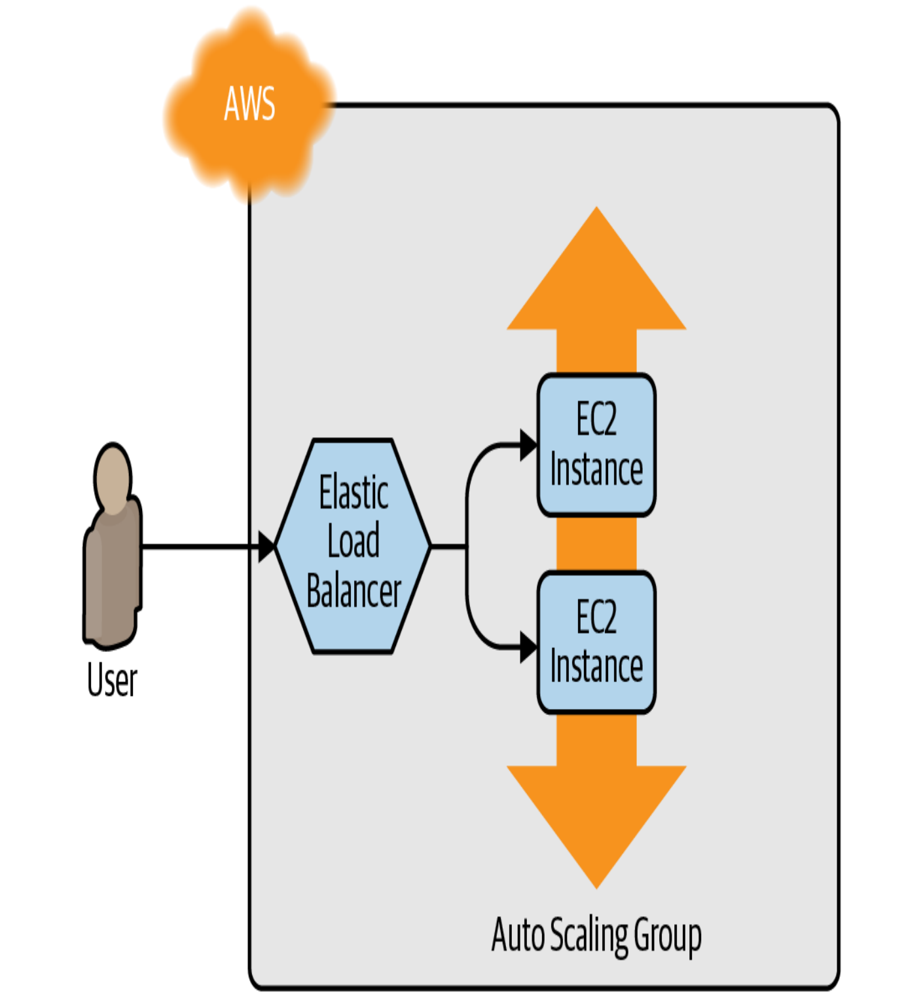

# Deploy a Load Balancer
Để phân phối traffic vào các EC2 Instance trong **Auto Scaling Group**, cần sử dụng **Elastic Load Balancer (ELB)** service.

**AWS** cung cấp 3 loại load balancer:
- **Application Load Balancer (ALB):** Phù hợp cho HTTP và HTTPS traffic.
- **Network Load Balancer (NLB):** Phù hợp cho TCP, UDP và TLS traffic.
- **Classic Load Balancer (CLB):** Là loại load balancer cũ, có thể xử lý cả HTTP, HTTPS, TCP, UDP và TLS traffic. Nhưng có ít features hơn ALB và NLB.

